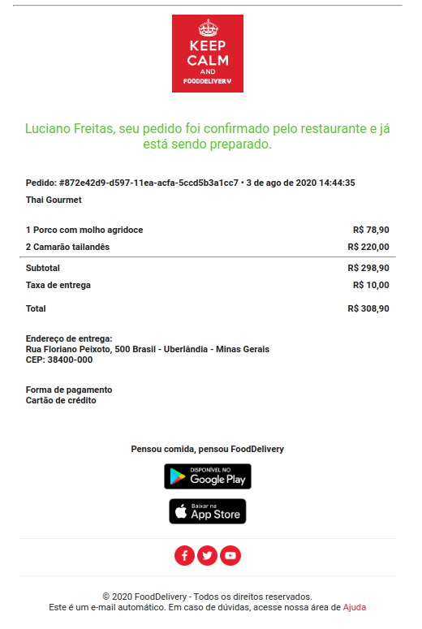
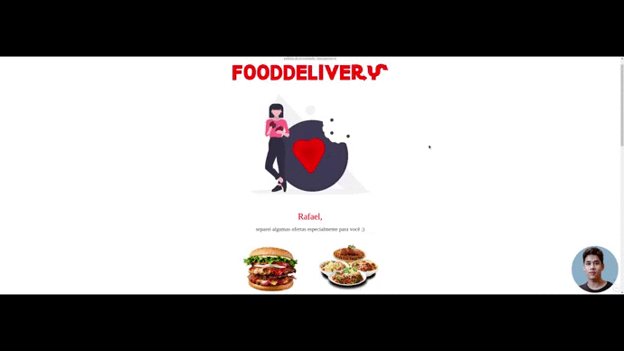

# E-mail Templates

## [Exemplo-1](ex-1/email-confirmation.html)

- Este é um template para confirmação de pedidos para restaurantes, baseado no template do iFood.
  

  

Um exemplo utilizando FreeMarker(uma biblioteca Java para gerar saída de texto de páginas da Web em HTML, emails dentre outros) pode ser encontrado [aqui](https://github.com/RafaelOFreitas/food-delivery/blob/master/src/main/resources/templates/order-confirmed.html).

## [Exemplo-2](ex-2/email-marketing.html)

- Este é um template para e-mail marketing ou publicidade por correio eletrônico.
- Baseado nos emails de marketing que recebo frequentemente :smile:

  

