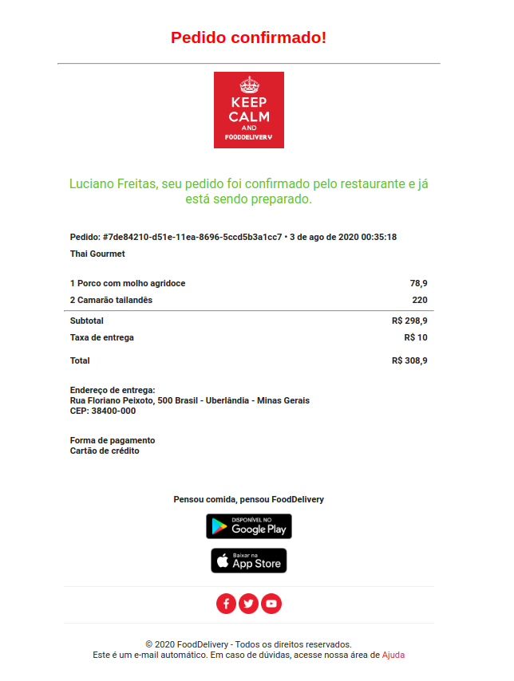

# E-mail Templates

## [Exemplo-1](ex-1/confirmation_restaurants.html)

- Este é um template para confirmação de pedidos para restaurantes, baseado no template do iFood.
  

  

Um exemplo utilizando FreeMarker(uma biblioteca Java para gerar saída de texto páginas da Web em HTML, emails) pode ser encontrado [aqui](https://github.com/RafaelOFreitas/food-delivery/blob/master/src/main/resources/templates/order-confirmed.html).